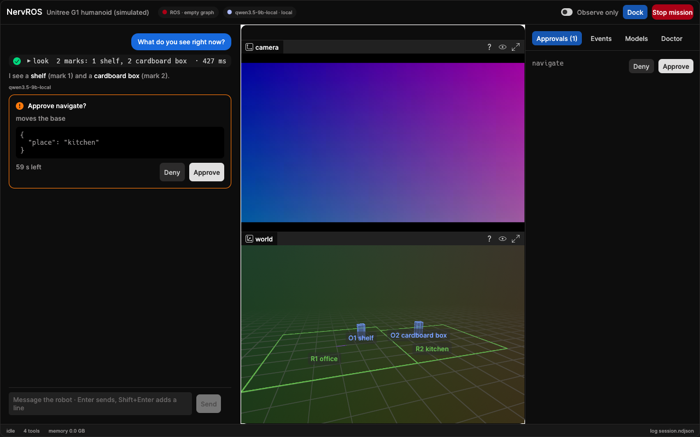

# NervROS

A native Rust agent for ROS 2 robots. You talk to it in a desktop app. It looks through the robot's
cameras, answers with marked-up images, and carries out tasks as behaviour trees that are checked
and approved before they run.

Status: early development. It is built and tested against
[grove-g1](https://github.com/Adyansh04/grove-g1), a Unitree G1 stack on ROS 2 Jazzy, in simulation.



## Try it

NervROS runs on the host next to a ROS 2 Jazzy graph. Tests use a local model, so nothing leaves
the machine:

```bash
./scripts/local-llm.sh start          # Qwen3.5-9B in llama.cpp on 127.0.0.1:8081
./scripts/build-overlay.sh            # builds nervros_interfaces once
source scripts/ros-env.sh             # bash; add NERVROS_UDP_ONLY=1 if the graph runs as root
cargo run -p nervros-gui -- --profile profiles/example/nervros.toml
```

`nervros-cli` does the same headless: `chat`, `doctor`, `look`, `models` and `ask`.

In the window, Enter sends, Esc stops the reply and Ctrl+Shift+S stops the mission. Ctrl+1 to
Ctrl+4 switch the dock between approvals, events, models and the connection check. The embedded
viewer is [Rerun](https://rerun.io), which keeps the camera, map, rooms and objects on a timeline.
