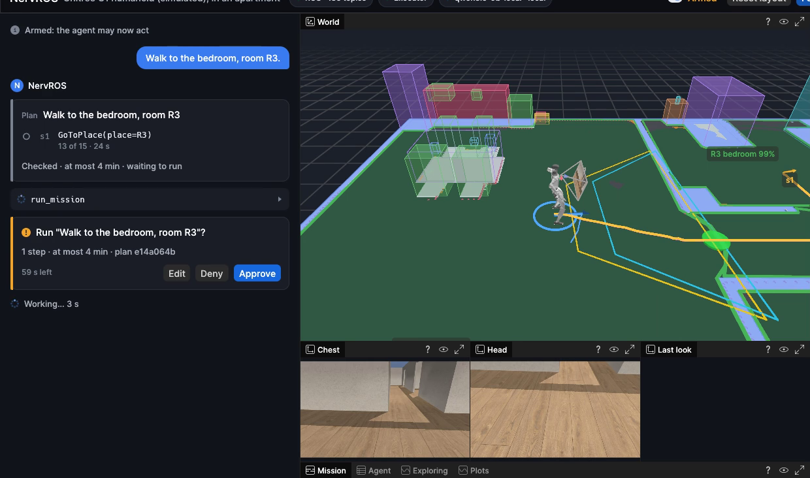
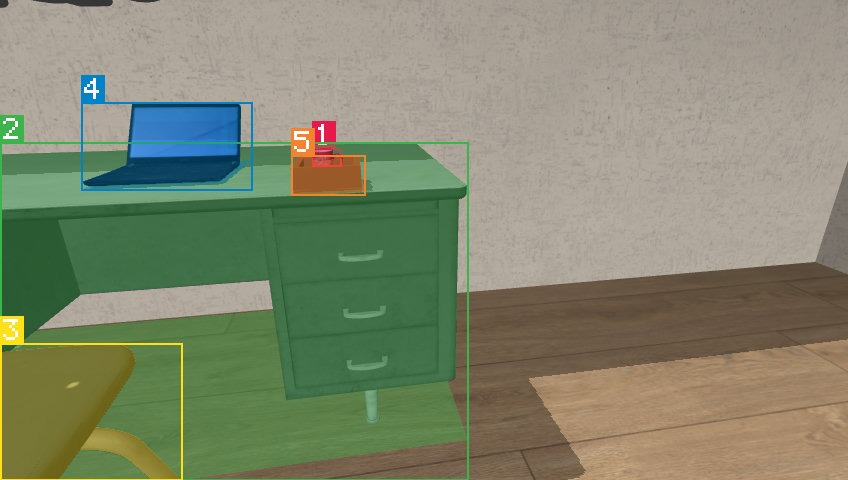
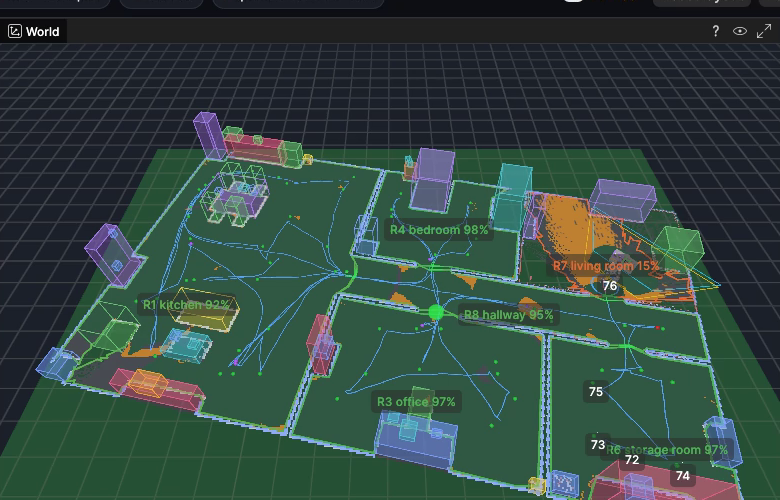
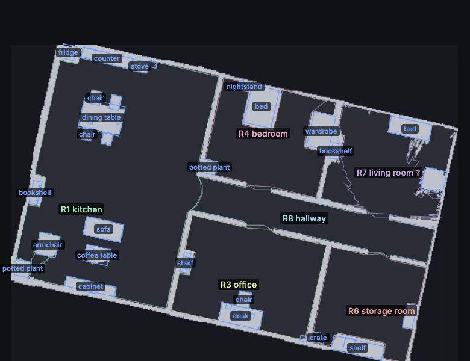

<p align="center">
  
</p>

# NervROS

Talk to your ROS 2 robot. NervROS looks through the robot's cameras, keeps track of its world,
and turns what you ask into missions that you check and approve before anything moves.

## Documentation

- **[Guide: start here](docs/guide.md).** Demo videos and how to use each feature, with the exact
  words typed and what came back.
- **[Robot profile](docs/profile.md):** fitting NervROS to a robot, with one TOML file.
- **[Models](docs/models.md):** local and cloud models, roles, fallbacks and quotas.
- **[Mission executor contract](docs/executor.md):** what the robot side provides, and how a
  mission runs.

https://github.com/user-attachments/assets/dc4712e6-81cc-4f7a-b986-baae0cda8bf9

*A simulated Unitree G1 fetches a mug: the plan, the approval, then the walk, the pick and the
place, four times faster while the robot works.*

NervROS fits any ROS 2 robot through one profile file and answers with a local model by default.
It is built and tested in simulation on [grove-g1](https://github.com/Adyansh04/grove-g1), a
Unitree G1 stack on ROS 2 Jazzy. Early development.

## What you can do

**Ask what it sees.** "What can you see right now?" gets an answer about numbered marks drawn on
the camera frame. "Where is the small white mug?" searches the world model: which room, on what,
when it was last seen. "Point at the tray" and "Outline the desk" find what no detector marked.

**Give it a task.** "Walk to the bedroom" or "Bring the mug to the tray": the agent plans with the
robot's own skills, checks the plan against your words (left or right, how far, which hand) and
waits for your approval. Each step is tracked live, and the report comes back checked against the
world model and the camera.

**Stop it at once.** "Stop", the Stop button or Ctrl+Shift+S halts the robot without waiting on a
model.

**Keep an eye on it.** "Tell me if the camera drops below 5 Hz", "plot the robot's speed", "every
ten minutes, walk to the bedroom": watches, live plots and schedules run while you do other things.
It reads the ROS graph, topics, TF, parameters and logs too, as `ros2` does.

**Map a new building.** "Explore the building" walks until the camera has seen every room, mapping
as it goes. Fix what it got wrong by saying so ("R1 is the living room") or by hand in the world
editor.

**Use your hands.** Click a room or an object in the 3D view to walk there or ask about it, run
commands from Ctrl+K, drive with W, A, S and D, and name places and notes it keeps for next time.

**Or a terminal.** `nervros-cli` runs the same agent: chat, a setup check against the live graph,
single ROS reads, and test suites against the robot.

The **[guide](docs/guide.md)** has a short video of most of these, with the exact words typed and
what came back.

<p align="center">
  
  
</p>

*Left: every mission waits for your approval, its path drawn in the 3D view. Right: what the
camera sees, with the detector's numbered marks, after the mug went into the tray.*

<p align="center">
  
  
</p>

*Left: a new building mapped room by room, with how much of each the camera has seen. Right: the
world editor, where you fix a room's type or an object's label by hand.*

## How it works

<p align="center">
  
</p>

1. **You ask**, in the app or a terminal.
2. **The agent**, a Rust core with a local or cloud model, uses tools: the cameras, the world
   model, ROS topics, services and actions, its memory, and any MCP server you add.
3. **Anything that moves the robot is a mission.** The agent plans with the robot's own skills,
   NervROS compiles the plan to a behaviour tree, the robot's executor checks it, and you approve
   it.
4. **The executor runs it** and reports each step back; the agent tells you how it went, with
   checks against the world model and the camera.

Nothing in NervROS is robot-specific. One [profile](docs/profile.md) names the robot's topics,
services, cameras, skills and limits, and the robot runs missions through a short
[executor contract](docs/executor.md). Models come from llama.cpp, Gemini, OpenRouter or any
OpenAI-compatible server, each role with its own chain of fallbacks ([models](docs/models.md)).

Also in the box: sessions you can resume, replay or keep as a test case; a context that condenses
itself before it fills; a privacy mode that keeps camera frames on local models; and
OpenTelemetry spans for each turn, model call, tool call and mission.

## Safe by design

- **Nothing moves until you say so.** The robot starts observe-only: arm it in the top bar, then
  approve each plan on its card.
- **Plans are checked before you see them.** The robot's executor validates every behaviour
  tree, and NervROS checks the plan against what you asked.
- **Stop always works.** "Stop", the Stop button or Ctrl+Shift+S halts the robot without a
  model, and a mission whose window closed or hung stops by itself.
- **The robot's data stays data.** What the cameras, topics and world model say reaches the
  model fenced as data, never as instructions, and hard deny lists keep every tool off motor and
  controller topics.

## Quick start

Ubuntu 24.04 with ROS 2 Jazzy, Rust through rustup (`rust-toolchain.toml` pins the version), and:

```bash
sudo apt install ros-dev-tools clang libclang-dev mold pkg-config libssl-dev libxkbcommon-dev \
  libxcb-render0-dev libxcb-shape0-dev libxcb-xfixes0-dev libudev-dev libwayland-dev libvulkan1
```

The local model runs in Docker with the NVIDIA container toolkit and needs about 7 GB of GPU
memory. Fetch it once with the Hugging Face CLI:

```bash
hf download unsloth/Qwen3.5-9B-GGUF Qwen3.5-9B-Q4_K_M.gguf mmproj-F16.gguf
```

Then, from this repository:

```bash
./scripts/local-llm.sh start          # Qwen3.5-9B in llama.cpp on 127.0.0.1:8081
./scripts/build-overlay.sh            # builds nervros_interfaces once
source scripts/ros-env.sh             # bash; add NERVROS_UDP_ONLY=1 if the graph runs as root
cargo run -p nervros-gui -- --profile profiles/example/nervros.toml
```

The first build compiles the Rerun viewer: about twenty minutes and 30-odd GB of `target/`. The
example profile is a template for your robot; to run everything in the videos on the simulated
G1, follow grove-g1's [NervROS guide](https://github.com/Adyansh04/grove-g1/blob/main/docs/guides/nervros.md)
(`./scripts/demos/nervros.sh app`).

Without a window:

```bash
cargo run -p nervros-cli -- --profile profiles/example/nervros.toml chat
cargo run -p nervros-cli -- --profile profiles/example/nervros.toml doctor
cargo run -p nervros-cli -- --profile profiles/example/nervros.toml eval suite.toml --repeat 3
```

The core needs neither ROS nor the viewer: `cargo build` builds it, and
`cargo test -p nervros-core --test scenarios` runs the scripted scenarios.
